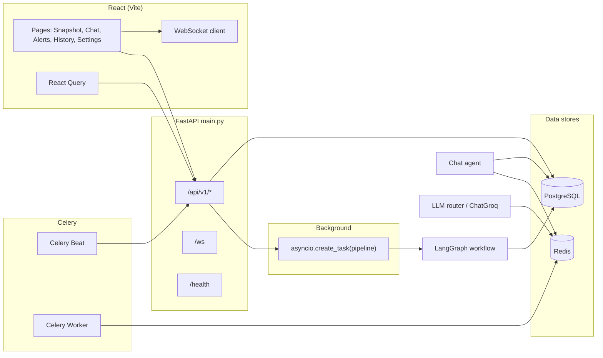
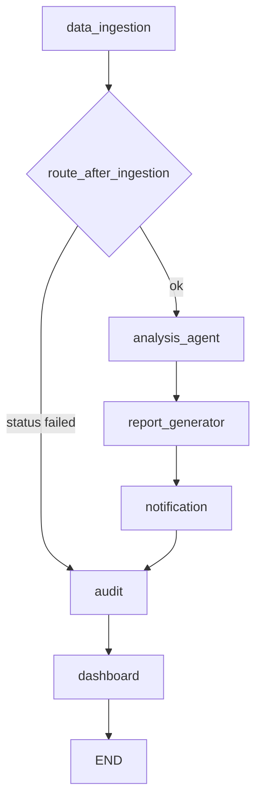

<div align="center">

# FinAgent OS · LedgerMind · CashPilot

**Agentic financial pipeline with CSV/JSON ingestion, LangGraph orchestration, tool-grounded chat, and PostgreSQL + Redis.**

<sub>Repository branding mixes **FinAgent OS** (paths/package names), **LedgerMind** (FastAPI metadata, health checks, notifications), and **CashPilot** (UI labels and agent prompts)—all names appear in source.</sub>

[](https://fastapi.tiangolo.com/)
[](https://react.dev/)
[](https://www.postgresql.org/)
[](https://redis.io/)

</div>

---

## Table of contents

1. [Project overview](#project-overview)
2. [Architecture overview](#architecture-overview)
3. [Tech stack](#tech-stack)
4. [Repository structure](#repository-structure)
5. [Backend deep dive](#backend-deep-dive)
6. [Frontend deep dive](#frontend-deep-dive)
7. [AI / agent architecture](#ai--agent-architecture)
8. [Database design](#database-design)
9. [Key engineering decisions](#key-engineering-decisions)
10. [API documentation](#api-documentation)
11. [Business logic & product workflows](#business-logic--product-workflows)
12. [Setup & installation](#setup--installation)
13. [Deployment](#deployment)
14. [Current limitations / incomplete areas](#current-limitations--incomplete-areas)
15. [Future improvements](#future-improvements)
16. [Technical highlights](#technical-highlights)
17. [Conclusion](#conclusion)

---

## Project overview

### What the system actually does

| Layer                 | What the code does                                                                                                                                                                                                                                                                                                                                                                                                                                       |
| --------------------- | -------------------------------------------------------------------------------------------------------------------------------------------------------------------------------------------------------------------------------------------------------------------------------------------------------------------------------------------------------------------------------------------------------------------------------------------------------- |
| **Ingest**            | Accepts **CSV or JSON** uploads via `POST /api/v1/run`, parses and normalises rows in [`backend/agents/data_ingestion.py`](backend/agents/data_ingestion.py) (pandas), writes [`Transaction`](backend/db/models.py) rows linked to a single [`BusinessProfile`](backend/db/models.py). Supports heuristic detection of **Stripe-shaped CSV** (`_is_stripe_export` / `_normalize_stripe`) among other formats—**file upload only**, not live Stripe APIs. |
| **Analysis pipeline** | After ingest, a **LangGraph** compiled in [`backend/graph/workflow.py`](backend/graph/workflow.py) runs **data ingestion → analysis agent → report generator → notification → audit → dashboard** (sequential edges except conditional skip from failed ingest).                                                                                                                                                                                         |
| **Financial maths**   | [`backend/tools/financial_tools.py`](backend/tools/financial_tools.py) exposes **`compute_pnl`**, **`compute_runway`**, **`query_transactions`**, **`compare_periods`**, **`find_anomalies`** (Z-score + optional EWMA baselines), **`get_category_trends`**. Used by REST snapshot (`GET /api/v1/snapshot`), chat tools, and analysis agent.                                                                                                            |
| **Chat**              | `POST /api/v1/chat` runs a **LangGraph ReAct loop** ([`backend/agents/chat_agent.py`](backend/agents/chat_agent.py)) with tools from [`backend/agents/chat_tools_lc.py`](backend/agents/chat_tools_lc.py); **non-streaming** JSON response; conversation memory in **Redis** (`chat:{session_id}`) + optional persistence to **`chat_messages`** in Postgres.                                                                                            |
| **Alerts / watch**    | [`POST /api/v1/internal/nightly-delta`](backend/api/routes.py) and [`POST /api/v1/internal/weekly-digest`](backend/api/routes.py) create [`Alert`](backend/db/models.py) rows and broadcast over WebSocket. Scheduled via **Celery Beat** in [`backend/celery_tasks/tasks.py`](backend/celery_tasks/tasks.py) (HTTP POST to those URLs).                                                                                                                 |
| **UI**                | Vite + React app: **Snapshot** dashboard, **Chat**, **Alerts**, **History**, **Settings**; WebSocket client with reconnect ([`frontend/src/hooks/useWebSocket.ts`](frontend/src/hooks/useWebSocket.ts)).                                                                                                                                                                                                                                                 |

### Core problem being solved

The codebase implements an **MVP single-tenant** “financial co-pilot”: upload transactions, run an automated analysis pipeline, store structured outputs and Markdown reports, explore metrics in a dashboard, and ask questions grounded in **tool-retrieved** numbers rather than free-form guesses.

### Real workflows supported

1. **Upload → async pipeline → poll status / WebSocket progress** (`POST /api/v1/run` → `GET /api/v1/runs/{id}/status`; duplicate uploads short-circuit via **SHA-256** hash match on completed runs).
2. **Snapshot dashboard** (`GET /api/v1/snapshot`) — period logic **anchored to min/max transaction dates** (see comments in `routes.py`).
3. **Chat Q&A** with tool traces surfaced in the UI (`tools_used` → [`ToolCallPill`](frontend/src/features/chat/components/ToolCallPill.tsx)).
4. **Alerts** list/read/delete + live refresh on WS `alert` messages.
5. **History** of pipeline runs with linked report summaries (`GET /api/v1/history`).
6. **Settings**: LLM provider visibility via `GET /api/v1/settings`; optional **data reset** (`DELETE /api/v1/data/reset`).

---

## Architecture overview

### High-level diagram



### Frontend ↔ backend interaction

- JSON calls use base URL `VITE_API_BASE_URL` + prefix **`/api/v1`** ([`frontend/src/lib/api.ts`](frontend/src/lib/api.ts)).
- Optional header **`X-API-Key`** when `VITE_API_KEY` matches backend `API_KEY` ([`backend/api/auth.py`](backend/api/auth.py)).
- WebSocket URL **`VITE_WS_URL`** (default `ws://localhost:8000/ws`); server accepts connections and **broadcasts** JSON payloads (`ConnectionManager` in [`backend/ws/manager.py`](backend/ws/manager.py)).

### Agent orchestration flow (LangGraph)

Sequential graph from [`build_graph`](backend/graph/workflow.py):



- **Conditional edge**: If ingestion sets `status: "failed"`, the graph jumps to **audit**, skipping analysis/report (see `route_after_ingestion`).

### Request lifecycle (pipeline upload)

1. Client `POST /api/v1/run` with multipart file → rate limit **3/minute** ([`slowapi`](backend/api/routes.py)).
2. Server computes **SHA-256**; if duplicate completed run exists → returns **`duplicate`** without re-running.
3. Inserts [`PipelineRun`](backend/db/models.py) with `running`, then **`asyncio.create_task(_run_pipeline_background(...))`** — returns **202** immediately.
4. Background task invokes **`await graph.ainvoke(initial_state)`**, updates `PipelineRun` on completion/failure.
5. Client may poll **`GET /api/v1/runs/{run_id}/status`** or listen on **`/ws`** for `agent_started` / `agent_done` / `agent_error` / `pipeline_complete`-style payloads (see [Dashboard caveat](#current-limitations--incomplete-areas)).

### Design choices (see referenced files)

| Decision                  | Where                                                                                                                                                         |
| ------------------------- | ------------------------------------------------------------------------------------------------------------------------------------------------------------- |
| Single-tenant business    | [`BusinessProfile`](backend/db/models.py) comment; [`get_or_create_profile`](backend/services/profile_service.py) selects `limit(1)`.                         |
| Provider failover + cache | [`run_agent`](backend/tools/llm_router.py): Redis cache (`llm:` keys), ordered providers, **synthetic fallback** JSON string if all fail.                     |
| Tool calls for grounding  | [`SYSTEM_PROMPT`](backend/agents/chat_agent.py) requires tools before numeric answers; [`financial_tools`](backend/tools/financial_tools.py) implementations. |
| Rate limiting             | [`slowapi`](backend/api/routes.py) on `/run` and `/chat`.                                                                                                     |

---

## Tech stack

Only components **present in `backend/requirements.txt`** and **`frontend/package.json`** (plus infra files).

| Category            | Technologies                                                                                                                                                  |
| ------------------- | ------------------------------------------------------------------------------------------------------------------------------------------------------------- |
| **Backend runtime** | Python 3.11 (`backend/Dockerfile`), FastAPI, Uvicorn, `slowapi`                                                                                               |
| **Database**        | PostgreSQL 15 (Docker), SQLAlchemy **async**, **asyncpg**, **Alembic**                                                                                        |
| **Cache / queue**   | **Redis** 7; **redis** (async client); **Celery** + Redis broker/backend                                                                                      |
| **AI**              | **LangGraph**, **LangChain Core**, **langchain-groq**, **langchain-google-genai**; direct **groq**, **google-generativeai**, **anthropic** packages           |
| **Data**            | **pandas**, **numpy**, **python-dateutil**                                                                                                                    |
| **Email**           | **sendgrid**                                                                                                                                                  |
| **Frontend**        | **React 18**, **TypeScript**, **Vite 5**, **Tailwind CSS**, **Radix UI** primitives, **TanStack Query**, **React Router 7**, **Recharts**, **react-markdown** |
| **Testing**         | **pytest**, **pytest-asyncio** (backend); **Vitest**, **Testing Library** (frontend)                                                                          |

---

## Repository structure

| Path                                                             | Responsibility                                                                                                                                                                                                                             |
| ---------------------------------------------------------------- | ------------------------------------------------------------------------------------------------------------------------------------------------------------------------------------------------------------------------------------------ |
| [`backend/main.py`](backend/main.py)                             | FastAPI app: CORS, **`/api/v1`** router, **`/ws`**, **`/health`**, startup `init_db()` + LLM provider logging                                                                                                                              |
| [`backend/api/routes.py`](backend/api/routes.py)                 | All HTTP endpoints under `/api/v1`                                                                                                                                                                                                         |
| [`backend/api/auth.py`](backend/api/auth.py)                     | **`X-API-Key`** vs `API_KEY` env (disabled if unset)                                                                                                                                                                                       |
| [`backend/db/models.py`](backend/db/models.py)                   | SQLAlchemy models + async engine + **`init_db()`** shelling out to **Alembic upgrade**                                                                                                                                                     |
| [`backend/db/redis_client.py`](backend/db/redis_client.py)       | Redis pool, LLM response cache helpers, **chat history** list ops                                                                                                                                                                          |
| [`backend/graph/workflow.py`](backend/graph/workflow.py)         | LangGraph definition (`FinAgentState`, node factories, `build_graph`)                                                                                                                                                                      |
| [`backend/agents/`](backend/agents/)                             | Ingestion, **analysis_agent**, **chat_agent**, **report_generator**, **notification**, **dashboard_agent**, **audit**, plus legacy modules (`pnl_analyzer`, `forecasting`, etc.—see [limitations](#current-limitations--incomplete-areas)) |
| [`backend/tools/`](backend/tools/)                               | **`financial_tools`**, **`llm_router`**, **`llm_with_tools`**, **`period_parser`**, **`json_utils`**                                                                                                                                       |
| [`backend/services/`](backend/services/)                         | **`profile_service`**, **`baseline_updater`**                                                                                                                                                                                              |
| [`backend/celery_tasks/tasks.py`](backend/celery_tasks/tasks.py) | Celery app, beat schedule, tasks posting to internal HTTP endpoints                                                                                                                                                                        |
| [`backend/ws/manager.py`](backend/ws/manager.py)                 | WebSocket fan-out                                                                                                                                                                                                                          |
| [`frontend/src/features/`](frontend/src/features/)               | Feature folders: `chat`, `snapshot`, `alerts`, `history`, `settings`                                                                                                                                                                       |
| [`frontend/src/store/`](frontend/src/store/)                     | `AppContext`, `AlertsContext`                                                                                                                                                                                                              |
| [`frontend/src/lib/api.ts`](frontend/src/lib/api.ts)             | Central fetch + upload + poll helpers                                                                                                                                                                                                      |
| [`docker-compose.yml`](docker-compose.yml)                       | `backend`, `frontend`, `postgres`, `redis`, `worker`, `beat`                                                                                                                                                                               |
| [`render.yaml`](render.yaml)                                     | Render **web** + **worker** + **beat** + **Redis** + managed Postgres                                                                                                                                                                      |
| [`scratch/generate_data.py`](scratch/generate_data.py)           | Auxiliary data generation (not part of runtime server)                                                                                                                                                                                     |
| [`data/*.csv`](data/)                                            | Sample CSV assets in repo                                                                                                                                                                                                                  |

---

## Backend deep dive

### API structure

- Global prefix: **`/api/v1`** ([`main.py`](backend/main.py) line 44).
- Router module: [`backend/api/routes.py`](backend/api/routes.py) (~900 lines).

### Services & business logic

| Module                                                                 | Role                                                                                                |
| ---------------------------------------------------------------------- | --------------------------------------------------------------------------------------------------- |
| [`services/profile_service.py`](backend/services/profile_service.py)   | Single profile CRUD; **`update_profile_after_run`** EWMA stats & health score history               |
| [`services/baseline_updater.py`](backend/services/baseline_updater.py) | Invoked after ingest to refresh **category EWMA** rows ([`CategoryBaseline`](backend/db/models.py)) |

### Database interactions

- Async sessions via [`get_db`](backend/db/models.py) dependency pattern.
- Startup migrations: [`init_db`](backend/db/models.py) runs **`alembic upgrade head`** subprocess.

### Agent systems (active pipeline)

| Node                 | Implementation                                                                                                                                                                    |
| -------------------- | --------------------------------------------------------------------------------------------------------------------------------------------------------------------------------- |
| **data_ingestion**   | [`agents/data_ingestion.py`](backend/agents/data_ingestion.py); updates baselines + profile via services                                                                          |
| **analysis_agent**   | [`agents/analysis_agent.py`](backend/agents/analysis_agent.py) — LangGraph ReAct with **`submit_findings`** tool + shared financial tools                                         |
| **report_generator** | [`agents/report_generator.py`](backend/agents/report_generator.py) — calls **`run_agent`** from [`llm_router`](backend/tools/llm_router.py), persists **`FinancialReport`**       |
| **notification**     | [`agents/notification.py`](backend/agents/notification.py) — **SendGrid** email if `SENDGRID_API_KEY`; expects `report_result` / `anomaly_result` keys on state (see limitations) |
| **audit**            | [`agents/audit.py`](backend/agents/audit.py)                                                                                                                                      |
| **dashboard**        | [`agents/dashboard_agent.py`](backend/agents/dashboard_agent.py) — broadcasts WebSocket snapshot                                                                                  |

### AI orchestration

| Path                             | Description                                                                                                                                                                                               |
| -------------------------------- | --------------------------------------------------------------------------------------------------------------------------------------------------------------------------------------------------------- |
| **Narrative / report text**      | [`tools/llm_router.py`](backend/tools/llm_router.py) **`run_agent`**: tries providers in chain (**Groq → Gemini → Anthropic → Ollama** when keys/`OLLAMA_BASE_URL` set), Redis cache, synthetic fallback. |
| **Tool-calling chat & analysis** | [`tools/llm_with_tools.py`](backend/tools/llm_with_tools.py) **`get_llm_with_tools`**: **ChatGroq** then **ChatGoogleGenerativeAI**; raises if neither configured.                                        |

### Background processing

| Mechanism    | Facts                                                                                                                                                                                                |
| ------------ | ---------------------------------------------------------------------------------------------------------------------------------------------------------------------------------------------------- |
| **Pipeline** | **`asyncio.create_task`** in-process ([`routes.py`](backend/api/routes.py)), not Celery                                                                                                              |
| **Celery**   | Broker/backend **Redis**; worker runs Celery; beat triggers **`nightly_delta_check`** and **`weekly_digest`** → HTTP **`INTERNAL_API_URL`** (default `http://backend:8000`) + `/api/v1/internal/...` |

### Proposed vs implemented (from [`docs/CashPilot Architecture.md`](../docs/CashPilot%20Architecture.md))

| Proposed in doc                                            | In this repo                                                                                                                                                                                             |
| ---------------------------------------------------------- | -------------------------------------------------------------------------------------------------------------------------------------------------------------------------------------------------------- |
| Stripe **webhook**, QuickBooks                             | **Not implemented** as HTTP integrations—only CSV normalization paths including Stripe-style **files**.                                                                                                  |
| **“Redis conversation memory”**                            | **Implemented**: Redis lists per session in [`redis_client.py`](backend/db/redis_client.py).                                                                                                             |
| **“Streaming” chat**                                       | **Not implemented**: chat returns full JSON; frontend uses “streaming” UI state for **loading**, not SSE/token stream.                                                                                   |
| **“Alert feed real-time via WebSocket”**                   | **Implemented** for alerts created server-side (`broadcast` with `type`/`data` from routes); pipeline progress uses **`push_agent_event`**.                                                              |
| **Watch engine: nightly delta, runway, digest**            | **Implemented** via internal POST handlers + Celery schedule in [`tasks.py`](backend/celery_tasks/tasks.py).                                                                                             |
| **LLM router chain Groq → Gemini → Anthropic → synthetic** | **`run_agent`** matches (plus **Ollama** when configured); synthetic fallback **implemented**. Chat tools path uses **Groq → Gemini only** (see [`llm_with_tools.py`](backend/tools/llm_with_tools.py)). |

---

## Frontend deep dive

### UI architecture

- **Layout**: [`AppShell`](frontend/src/components/layout/AppShell.tsx) wraps routes; [`Sidebar`](frontend/src/components/layout/Sidebar.tsx) navigation labels **CashPilot**.
- **Routing**: [`App.tsx`](frontend/src/App.tsx) — `/`, `/chat`, `/alerts`, `/history`, `/settings`, **`/showcase`**, catch-all → `/`.
- **Reports page**: [`frontend/src/pages/Reports.tsx`](frontend/src/pages/Reports.tsx) exists and calls `/api/v1/reports` but is **not registered** in `App.tsx` routes (dead route unless linked manually).

### State management

- **Server state**: **TanStack Query** (`QueryClient` in [`App.tsx`](frontend/src/App.tsx)).
- **Cross-cutting UI**: [`AlertsContext`](frontend/src/store/AlertsContext.tsx) for unread counts; [`AppContext`](frontend/src/store/AppContext.tsx) for app-wide shell state.

### Data fetching

- All JSON requests through [`apiFetch`](frontend/src/lib/api.ts) → `{BASE}/api/v1{path}`.
- Uploads: **`apiUpload`** → `POST /api/v1/run` via XHR (progress events).
- Chat: [`useChatSession`](frontend/src/features/chat/hooks/useChatSession.ts) → **`POST /api/v1/chat`** (non-streaming).

### Components & patterns

- **Feature folders** under `src/features/*` with colocated `hooks/` and `components/`.
- **Design system**: Tailwind + [`cn`](frontend/src/lib/cn.ts); primitives in [`components/ui/`](frontend/src/components/ui/).
- **Tests**: Vitest + Testing Library in `__tests__` folders (e.g. alerts).

---

## AI / Agent architecture

### Responsibilities

| Agent / graph          | Responsibility                                                                                                                                               |
| ---------------------- | ------------------------------------------------------------------------------------------------------------------------------------------------------------ |
| **Pipeline LangGraph** | Orchestrates ingest → analysis → report → notification → audit → dashboard                                                                                   |
| **Analysis agent**     | LangGraph loop with tools + **`submit_findings`** ([`analysis_agent.py`](backend/agents/analysis_agent.py)); max recursion tied to **`MAX_ITERATIONS = 10`** |
| **Chat agent**         | Separate LangGraph; **`MAX_TOOL_ITERATIONS = 8`** safety                                                                                                     |
| **Report generator**   | Uses **`run_agent`** with `prefer_provider="anthropic"` then fallback chain                                                                                  |

### Tool usage

Tools are built per request in **`build_chat_tools(db, business_id)`** and wrap [`financial_tools`](backend/tools/financial_tools.py).

### Memory / state flow

| Store                         | Purpose                                                                                                 |
| ----------------------------- | ------------------------------------------------------------------------------------------------------- |
| **Redis** `chat:{session_id}` | LangChain messages serialized JSON; trim to last **100** entries; TTL **24h** (`CHAT_TTL`)              |
| **Postgres `chat_messages`**  | Persists user + assistant turns after each chat reply ([`chat_agent.py`](backend/agents/chat_agent.py)) |

### Multi-agent coordination

- **Pipeline**: single sequential LangGraph (not multi-agent debate pattern).
- **Chat vs pipeline**: independent entrypoints (`/chat` vs `/run`).

### Prompt architecture

- Chat system prompt in [`chat_agent.py`](backend/agents/chat_agent.py) (`SYSTEM_PROMPT`).
- Analysis system prompt in [`analysis_agent.py`](backend/agents/analysis_agent.py) (`ANALYSIS_SYSTEM_PROMPT`).
- Report system prompt in [`report_generator.py`](backend/agents/report_generator.py).

### LLM provider integration

| Use case                   | Entry point          | Providers (code)                                    |
| -------------------------- | -------------------- | --------------------------------------------------- |
| Markdown executive report  | `run_agent`          | Chain in **`llm_router`** incl. optional **Ollama** |
| Chat & analysis tool loops | `get_llm_with_tools` | **Groq**, **Gemini** only                           |

---

## Database design

### Models (Alembic-managed)

| Table                    | Purpose                                                           |
| ------------------------ | ----------------------------------------------------------------- |
| **`pipeline_runs`**      | Run metadata, **`data_hash`** for dedup, status enum              |
| **`transactions`**       | Normalised transactions; **`business_id`** FK                     |
| **`audit_logs`**         | Agent actions, tokens, duration                                   |
| **`financial_reports`**  | JSON blobs + **`markdown_report`**, **`executive_summary`**       |
| **`anomalies`**          | Structured anomaly records (pipeline legacy path)                 |
| **`business_profiles`**  | Single-tenant profile, health score, EWMA summaries, history JSON |
| **`category_baselines`** | Per-category monthly EWMA + std for anomaly detection             |
| **`alerts`**             | Watch-engine and operational alerts                               |
| **`chat_messages`**      | Persisted chat                                                    |

### Relationships (foreign keys)

- **`transactions.business_id` → `business_profiles.id`**
- **`category_baselines.business_id` → `business_profiles.id`**
- **`alerts.business_id` → `business_profiles.id`**
- **`chat_messages.business_id` → `business_profiles.id`**

### Persistence strategy

- SQLAlchemy async with **`pool_pre_ping`** on engine ([`models.py`](backend/db/models.py)).
- Migrations: **`backend/alembic/versions/`** (initial schema, CashPilot tables, timezone-aware datetimes, `data_hash`).

---

## Key engineering decisions

1. **Immediate 202 + background asyncio task** — avoids blocking HTTP during LLM-heavy graph.
2. **SHA-256 deduplication** — prevents repeat processing of identical file bytes.
3. **Data-aware dates** — Snapshot and runway logic use transaction min/max, not “today only” ([`routes.py`](backend/api/routes.py) comments).
4. **Graceful LLM degradation** — synthetic JSON-like fallback text when all providers fail ([`llm_router.py`](backend/tools/llm_router.py)).
5. **Single-tenant MVP** — simplifies auth and profile lookups at cost of scalability (explicit in code comments).

---

## API documentation

Interactive OpenAPI is served by FastAPI at **`/docs`** when the server runs.

### Important endpoints

| Method   | Path                                | Auth                         | Notes                                                                         |
| -------- | ----------------------------------- | ---------------------------- | ----------------------------------------------------------------------------- |
| `POST`   | `/api/v1/run`                       | `X-API-Key` if `API_KEY` set | Multipart `file`, `file_type`, `triggered_by`; **202**; rate **3/min**        |
| `GET`    | `/api/v1/runs/{run_id}/status`      | Open                         | Poll pipeline status                                                          |
| `GET`    | `/api/v1/runs`                      | Open                         | Last 50 runs                                                                  |
| `GET`    | `/api/v1/snapshot`                  | Open                         | Dashboard aggregate                                                           |
| `POST`   | `/api/v1/chat`                      | Key if set                   | JSON body `message`, `session_id`; rate **20/min**                            |
| `GET`    | `/api/v1/chat/{session_id}/history` | Open                         | Redis-backed history                                                          |
| `DELETE` | `/api/v1/chat/{session_id}`         | Open                         | Clears Redis session                                                          |
| `GET`    | `/api/v1/alerts`                    | Open                         | Lists alerts                                                                  |
| `PATCH`  | `/api/v1/alerts/{id}/read`          | Open                         | Mark read                                                                     |
| `DELETE` | `/api/v1/alerts/{id}`               | Open                         | Delete alert                                                                  |
| `GET`    | `/api/v1/history`                   | Open                         | Runs + report snippets                                                        |
| `GET`    | `/api/v1/reports`                   | Open                         | Report list                                                                   |
| `GET`    | `/api/v1/reports/{id}`              | Open                         | Full report payload                                                           |
| `GET`    | `/api/v1/audit/{run_id}`            | Open                         | Audit entries                                                                 |
| `GET`    | `/api/v1/settings`                  | Open                         | Provider flags + models + tax rate                                            |
| `DELETE` | `/api/v1/data/reset`                | Key if set                   | Wipes data + Redis `chat:*`                                                   |
| `POST`   | `/api/v1/internal/nightly-delta`    | `X-Internal-Secret`          | Intended for Celery/service-to-service traffic only                           |
| `POST`   | `/api/v1/internal/weekly-digest`    | `X-Internal-Secret`          | Intended for Celery/service-to-service traffic only                           |
| `GET`    | `/health`                           | Open                         | `{"status":"ok","service":"LedgerMind"}`                                      |
| `WS`     | `/ws`                               | Open                         | Broadcast-only from server; client messages ignored except keep-alive receive |

---

## Business logic & product workflows

1. **Upload**: User uploads CSV/JSON → ingest infers categories / cleans amounts → transactions stored → baselines & profile updated.
2. **Pipeline analysis**: ReAct agent gathers insights → report generator produces Markdown via LLM → optional email if SendGrid configured and state keys align.
3. **Snapshot**: Computes P&L comparison (month anchored to data), runway (**EWMA burn** over last 3 anchored months in tool impl), 12-month chart, top anomalies from **`find_anomalies`**.
4. **Watch engine**: Nightly internal job evaluates runway warnings, baseline-based anomalies, margin trend via **`compare_periods`**; weekly job builds digest text via LLM and stores **`digest`** alert.

---

## Setup & installation

### Prerequisites

- **Docker / Docker Compose** _or_ local **Python 3.11+**, **Node 20+**, **PostgreSQL**, **Redis**.

### Environment variables

Authoritative templates:

- **Root**: [`.env.example`](.env.example) — database, Redis, LLM keys, `API_KEY`, `INTERNAL_API_SECRET`, `ENVIRONMENT`, SendGrid.
- **Frontend**: [`frontend/.env.example`](frontend/.env.example) — `VITE_API_BASE_URL`, `VITE_WS_URL`, `VITE_API_KEY`.

Backend reads **`../.env`** relative to `backend/main.py` ([`main.py`](backend/main.py) lines 6–7).

### Docker Compose (repository-provided)

From repository root:

```bash
cp .env.example .env
# Edit .env — at least one of GROQ_API_KEY or GEMINI_API_KEY for tool-calling + reports path
docker compose up --build
```

Services ([`docker-compose.yml`](docker-compose.yml)): **backend** (`uvicorn main:app --reload`), **frontend** (image builds static **serve** on 5173), **postgres**, **redis**, **worker** (Celery), **beat** (Celery Beat).

### Native development

**Backend**:

```bash
cd backend
python -m venv .venv && source .venv/bin/activate
pip install -r requirements.txt
# DATABASE_URL / REDIS_URL must point to running services
alembic upgrade head
uvicorn main:app --reload
```

**Frontend**:

```bash
cd frontend
npm install
npm run dev   # default port 5173 per vite.config.ts
```

### URLs (this is in local machine - I still need to deploy this project).

| Surface        | URL                            |
| -------------- | ------------------------------ |
| Frontend (dev) | `http://localhost:5173`        |
| API            | `http://localhost:8000`        |
| OpenAPI        | `http://localhost:8000/docs`   |
| Health         | `http://localhost:8000/health` |

---

## Deployment

### Docker

- [`backend/Dockerfile`](backend/Dockerfile): Python 3.11 slim, installs `requirements.txt`.
- [`frontend/Dockerfile`](frontend/Dockerfile): multi-stage **`npm run build`**, serves **`dist`** with **`serve`** on port 5173.

**Implementation note:** Vite embeds `import.meta.env` at **build time**. Building the frontend image without build-args may bake default API URLs—verify **`VITE_*`** for your environment.

### Render (`render.yaml`)

Defines:

- **Web service** `finagent-backend` — `uvicorn main:app --host 0.0.0.0 --port $PORT`
- **Workers** — Celery worker + Celery beat
- **Redis** + **Postgres** (`finagent-db`)

Env vars listed include **Anthropic, SendGrid, DATABASE_URL, REDIS_URL**, etc.; **`GROQ_API_KEY` / `GEMINI_API_KEY` are not enumerated** in `render.yaml`—they must be added manually if needed.

Set these in deployed environments:

- `ENVIRONMENT=production` to enforce fail-closed auth behavior.
- `API_KEY` for protected public API routes.
- `INTERNAL_API_SECRET` on both backend and Celery workers (must match).
- `INTERNAL_API_URL` so Celery workers can reach the backend process.

---

## Current limitations / incomplete areas

| Area                                     | Notes                                                                                                                                                                                                                                                                                                                                                                                                                                                                  |
| ---------------------------------------- | ---------------------------------------------------------------------------------------------------------------------------------------------------------------------------------------------------------------------------------------------------------------------------------------------------------------------------------------------------------------------------------------------------------------------------------------------------------------------- |
| **Product naming**                       | **LedgerMind** vs **CashPilot** vs **FinAgent** used interchangeably (`main.py`, UI, prompts).                                                                                                                                                                                                                                                                                                                                                                         |
| **Dashboard WebSocket payload mismatch** | [`_serialize_state_snapshot`](backend/agents/dashboard_agent.py) reads `pnl_result`, `forecast_result`, `anomaly_result`, `reconciliation_result`; **`FinAgentState`** in [`workflow.py`](backend/graph/workflow.py) defines **`ingestion_result`**, **`analysis_findings`**, **`report_result`**, etc., but **not** those legacy keys → **`pipeline_complete` metrics are largely empty** until dashboard serialization reads the same keys the graph actually fills. |
| **Notification agent**                   | [`send_notifications`](backend/agents/notification.py) emails on `report_result` when `status == "completed"` (report email can fire). **`anomaly_result` is never populated** by the current graph → **critical-anomaly email branch effectively unused**.                                                                                                                                                                                                            |
| **Stripe / Plaid integrations**          | Settings UI toggles **local React state only** ([`Settings.tsx`](frontend/src/features/settings/Settings.tsx)); **no OAuth/API**.                                                                                                                                                                                                                                                                                                                                      |
| **Reports page**                         | Not wired in [`App.tsx`](frontend/src/App.tsx) router.                                                                                                                                                                                                                                                                                                                                                                                                                 |
| **Internal cron endpoints**              | Secured with **`X-Internal-Secret`**; production now fails closed when `INTERNAL_API_SECRET` is missing.                                                                                                                                                                                                                                                                                                                                                               |
| **Legacy agent modules**                 | `pnl_analyzer.py`, `forecasting.py`, `anomaly_detection.py`, `reconciliation.py` exist but are **not imported by `workflow.py`** (only tests reference some).                                                                                                                                                                                                                                                                                                          |
| **Chat “streaming”**                     | UI flag **`isStreaming`** is loading state only; **no token streaming** from API.                                                                                                                                                                                                                                                                                                                                                                                      |
| **Celery module docstring**              | [`tasks.py`](backend/celery_tasks/tasks.py) header still describes posting to **`/run`** in prose; actual tasks call **`/internal/*`** (stale comment vs code).                                                                                                                                                                                                                                                                                                        |

---

## Future improvements

1. **Extend endpoint coverage** for stricter auth if internal routes increase (and keep shared secret rotation policy).
2. **Align `FinAgentState` and `push_update`** so WebSocket dashboard metrics reflect actual pipeline outputs—or simplify `_serialize_state_snapshot` to fields that exist.
3. **Register `/reports`** route or remove orphan page; optionally reuse `apiFetch` for consistency.
4. **Integration backends** for Stripe/Plaid instead of placeholder toggles.
5. **SSE or WebSocket streaming** for chat if product requires true streaming.
6. **Multi-tenant** model (multiple `BusinessProfile` rows + auth mapping).

---

## Technical highlights

- **LangGraph**-based pipeline with **conditional routing** after ingestion and **structured audit logging**.
- **Multi-provider LLM router** with **Redis caching**, ordered failover, and **synthetic fallback** to keep pipelines alive when APIs fail.
- **Deterministic financial tool layer** (pandas/numpy statistics, EWMA baselines, period parser) **composed with** LLM reasoning for chat and analysis.
- **Async FastAPI** + **Alembic** + **async SQLAlchemy** + **deduplicating** ingestion API (hash-based).
- **Operational hooks**: Celery Beat scheduling, internal financial watch endpoints, WebSocket broadcasts.
- **Frontend**: TanStack Query, feature-based structure, Vitest tests for alerts/history components.

---

## Conclusion

This repository is a **single-tenant financial agent MVP**: upload transactions, run a **LangGraph** pipeline (ingest → ReAct analysis → Markdown report), browse **snapshots and alerts**, and chat with **tool-grounded** responses backed by **PostgreSQL** and **Redis**. Dashboard/WebSocket payload alignment, deeper integration backends, and deployment hardening remain the main follow-ups—see [limitations](#current-limitations--incomplete-areas) and [deployment](#deployment).
